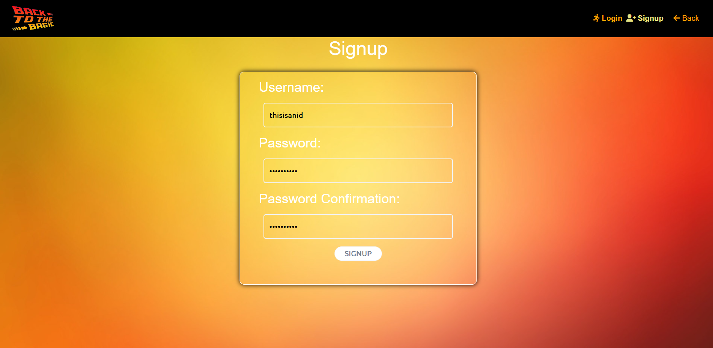

# 🎬영화 추천 서비스 

## [Back to the Basic]

#### 김철현, 홍인표

##### 가장 기본으로 돌아가자.

영화 추천을 위해 가장 기본적인(Basic) 서비스 구현에 초점을 두었다.

로고와 팀명은 고전 명작 Back To The Future에서 영감을 얻었다.

**가장 기본적인 서비스**로서 "영화 검색"과 "커뮤니티" 그리고 "유저의 성향에 따른 영화 추천"을 선정했다.

근본적인 목표

##### Django rest_api 와 Vue Axios 활용한 비동기 통신 구현 

##### 		=> 각 페이지에서 필요한 정보들만 서버로 요청하여 응답 받아 통신 비용 절감 효과

​																	+

​					

## 프로젝트 기간

- 22.05.20 ~ 22.05.27

## 업무 분담

|  이름  |                     업무                      |          프레임워크          |
| :----: | :-------------------------------------------: | :--------------------------: |
| 김철현 |         프론트엔드 총괄 / 디자인 총괄         | Vue.js, Html, CSS, SCSS, Git |
| 홍인표 | 백엔드 총괄 / 데이터 전처리 / 프론트엔드 보조 | Django, Python, Vue.js, Git  |

## 주요 기능

- 최초 회원가입 시 7개 사진들에 대한 이미지 반응으로 유저의 성격 세분화(총 3가지) 

- 나만의 추천영화(위 성격 기준 장르 추천), 전체 영화, 배우별, 감독별, 장르별, 영화 제목별 조회 기능(TMDB API 기반)
- 영화 상세 정보 조회 (줄거리, 트레일러, TMDB 평점, 제작진[감독, 배우] 등)
- 각 영화별 유저 리뷰 가능, 영화 상세 정보란에서 유저에 따른 영화 평점 조회 가능, 영화 좋아요 기능
- 커뮤니티 기능, 전체 유저를 위한 게시판과 같은 성격을 가진 유저들만을 위한 게시판 존재

- 유저별 프로필에서 해당 유저가 좋아요한 영화, 게시글 및 댓글, 작성한 리뷰 및 게시글 조회 가능, 해당 항목 클릭시 router로 이동

## ERD 설계 

[초기 버전]

[최종 버전]

erdcloud에서 작업 진행

청록색 항목은 Many To Many 관계를 의미한다.

초기 버전에 비해 각 모델별로 필요한 항목들을 좀 더 보충하였다.

## App Diagram

appdiagrams에서 작업 진행

## 상세 설명

##### 0. 영화데이터 수집(dataFromTmdb.py)

- Python requests 활용 TMDB API DATA 수집

- 총 19개의 장르 데이터에 성격 유형 별 숫자 배정(성격 유형은 총 3가지로 정의, 추후 성격 별 숫자는 유저 별 칭호라고 부르겠음)

- 200개의 영화 데이터 조회 후 

  - 개봉일자
  - 장르
  - 비디오 키

  위 세 가지 값이 존재하는 영화 데이터 선별

- 선별된 영화 데이터 중 배우 데이터와 감독 데이터가 존재하는 데이터 json 형태로 저장 후 Django에서 loaddata 진행

##### 1. 인트로 페이지

##### 주요 기능

- 필름이 돌아가는 동영상과 bgm 재생
- 일정 시간 경과 후 start 버튼이 반짝하며 생성됨

##### 2. 로그인, 회원가입

##### 주요 기능

- 입력 오류 시 에러 메세지 삽입 

##### 3. 질문 페이지

##### 주요 기능

- 사진을 보고 버튼 클릭 시 해당 점수에 맞게 총 점수 갱신
- 결과 페이지에 유저의 점수에 맞는 칭호를 보여주고, axios 통신으로 db에 해당 값 저장(user.nickname)

- 네비게이션 가드로 재접근 불가능하게끔 설계

### 영화

##### * 모든 영화 공통

##### 포스터 hover => 돋보기 아이콘 생성, 아이콘 클릭 시 영화 트레일러 등을 볼 수 있는 mock up 페이지

##### 해당 페이지 내 영화 상세보기로 이동 가능한 detail 버튼 존재

##### * 모든 영화 데이터는 Django REST Frame work와 Vue.js의 Axios 통신으로 불러옴

##### 4. 메인 페이지

##### 주요 기능

- vue-gliad를 활용, 일정 시간마다 영화 포스터 옆으로 이동 및 마우스 드래그로 넘겨볼 수 있음
- 포스터 항목별 hover - pause

##### 5. 사이드 바

##### 

##### 주요 기능

- 항목별 hover, 버튼 애니메이션 작동 
- 버튼 클릭 시 해당 페이지로 이동(router 이동)

##### 6. recommendation 페이지 (사이드바 - my list)

##### 주요 기능 

- 유저 별 칭호에 따른 장르 별 영화 추천

##### 7. title 페이지

##### 주요 기능

- 페이지 들어갈 시 전체 영화 데이터 호출
- 찾고자 하는 제목 입력 시 해당 제목을 포함하는 영화 가져오기

##### 8.  actor 페이지

##### 주요 기능

- 페이지 들어갈 시 전체 배우와 그 배우의 출연작 호출
- 배우 이름 입력 시 해당 단어를 포함하는 배우와 그의 출연작 가져오기

##### 9. director 페이지

##### 주요 기능

-  배우와 동일, 배우 => 감독으로의 변화

##### 10. genre 페이지

##### 주요 기능

- 상단에 각 장르별 버튼 존재, 페이지 들어갈 시 각 장르에 대한 모든 영화 호출
- 특정 버튼 클릭 시 해당하는 장르에 맞는 영화 가져오기

##### 11. detail 페이지

##### 주요 기능

- 영화 제목, 줄거리, TMDB 평점, 유저 평점, 개봉일, 좋아요, 장르, 출연 배우 및 감독 정보 탑재

- 하단에 리뷰(평점과 코멘트) 남기기 가능, 한 아이디 당 한 영화에 최대 한 번만 리뷰 가능

  

### 커뮤니티

##### 작성자 클릭 시 유저의 프로필로, 제목 클릭 시 해당 글의 detail 페이지로 이동

##### 게시글 작성 버튼 클릭 후 게시글 작성 시 각  게시판 별로 데이터 저장

##### 한 페이지 당 5개 게시물 씩 화면에 보이도록 설정

##### 각 게시글에 [게시글]과 [댓글] 버튼 존재

##### 11. 전체 게시판

##### 주요 기능 

- 칭호 구분 없이 모든 유저가 공유하는 게시판, 모든 유저가 CRUD 가능

##### 12. 비밀 게시판

##### 주요 기능

- 각 유저별 칭호에 맞는 게시판으로 이동할 수 있게끔 설계

- 같은 칭호의 유저가 작성한 글 열람 가능(전체 게시판에서는 열람할 수 없는 글들임)

  

### 마이페이지

##### 유저의 좋아요한 영화 / 리뷰한 영화 / 작성한 게시글 / 좋아요한 게시글 / 작성한 댓글을 볼 수 있음

##### 좋아요한 영화는 포스터, 나머지는 게시판에 적용한 것과 같은 Table로 화면에 송출

### 관리자

##### django의 createsuper 유저로 아이디 생성 후 접속 시 NavBar에 관리자 페이지(Django admin page 사용)로 이동 가능

##### 로그인 후 유저 및 영화 데이터 관리 가능

## 문제점 및 해결 방안

[1] 초기 ERD 구성의 어려움 

 데이터를 바닥부터 작성하는 작업이라 시간 소요가 꽤 컸다. 

 => 여러 에러를 맞이하며 중간 중간 계속 상황에 맞게 수정하였다.

[2] Django REST Framework 와 Vue.js Axios 통신에 대한 이해

 각 프로그래밍 언어 별 얕은 지식만 가진 상황에서 두 언어를 연결시키는 과정 자체가 몹시 난이도가 높았다.

=> TMDB API를 통해 데이터를 받아오며 json 데이터에 대한 이해를 증진시켰고, 

vue.js의 axios 통신이 django의 서버로 요청을 보낸다는 것을 코드를 작성하며 깨달으면서 전체 구조에 대한 이해가 되었다.

[3] Serializer의 fields값 설정

 정확히 어떤 데이터가 필요할 지 예상하지 못했고, Serializer의 fields 값을 최소화 하였다.

Axios  작업 도중 분명 Django model에 선언한 값임에도 불구하고 데이터를 불러올 수 없는 상황이 되어서야

기초 Serializer를 잘못 설정했다는 것을 깨달았다.

=> 우선 모든 Serializer의 fields 값을 all로 갱신하였다. 이 경우 에러가 발생하지 않지만, 서버의 속도가 눈에 띄게 느려짐을 확인할 수 있었다. 해당 부분은 프로젝트가 종료한 이후에도 재검토하여 최적화를 시켜야 할 것 같다.

## 후기

홍인표 : 

철현님과 함께 할 수 있어서 영광이었다. 내가 계속 중간 중간마다 뜬금없는 아이디어를 제시했고, 가끔은 해당 아이디어가 프로젝트의 큰 틀과 맞지 않음에도 경청해주셔서 감사했다. 또한, 비록 오류가 폭발하는 상황이 많았지만, 그 때 마다 침착히 상황을 극복하려 애쓰시는 모습에 감동했다.

7일 동안 하루 평균 12시간 이상의 시간을 코딩에 사용했다. 비록 건강이 많이 상하는 느낌이 들지만, 오류 폭탄에서 벗어날 때 마다 이루 말할 수 없는 쾌감이 오감을 관통했다. 이래서 관통 프로젝트 인 것 같다.

오류를 해결하기 위해 수 시간 구글링을 하고, console 창과 visual studio의 터미널을 보며 왜 오류가 발생했을까에 대해 생각하는 과정이 재밌었다. 해당 과정이 추후 비슷한 오류가 발생했을 때 몇 분도 채 되지 않아서 알아차릴 수 있게 되었고, 스스로가 성장 하고 있음을 느끼는 큰 계기이자 자신감을 갖게되는 계기가 되었다.

시간이 부족하여 로딩 중을 표현할 수 있는 로딩 스피너를 추가하지 못한 점이 아쉽다. 이런 부분을 보완하여 일회성 프로젝트로 끝내는 것이 아닌, 모든 에러가 정복된 완전한 프로젝트로 만들고 싶다.

김철현 : 

김철현 : 정말 힘든 1주일이였다ㅎㅎ css를 좀 더 열심히 공부해 놓았더라면 시간을 많이 절약할 수 있었을 텐데 시행착오를 많이 겪다보니 시간이 엄청 오래 걸렸다. 꾸미는 것에 있어 욕심이 계속 나서 더 나은 코드들을 살펴보다가 시간을 많이 허비했고(하루는 three.js만 쳐다본 적도 있었다..결국 못써먹었지만) 또한 그 코드를 적용함에 있어서 어려움도 많았다. 프로젝트 시작 전에 vue에 대한 두려움이 컸는데 vuex는 생각보다 수월했고 css, scss 활용이 많이 힘들었다 그리고 내가 미적 감각이 없다는 것을 다시 한번 깨달았다. 

먼저 같이 하자고 얘기해주신 인표님께 너무 너무 감사하다. 무계획에 벼락치기를 좋아하는 나를 잘 이끌어주셨다. 초반에 인표님이 아니였다면 정말 자연 그대로의 영화추천사이트가 탄생했을 것이다. 내가 기획한 디자인도 진심인지 모르겠지만? 정말 좋아해주셔서 감사했다:star: 너무 수고 많으셨습니다!!!:star2: